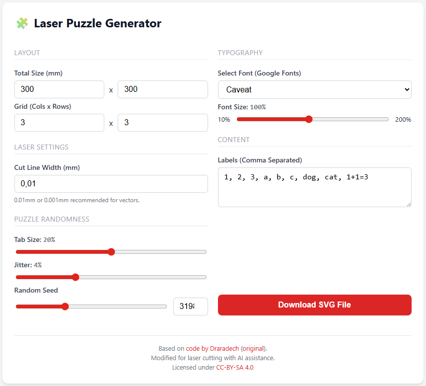
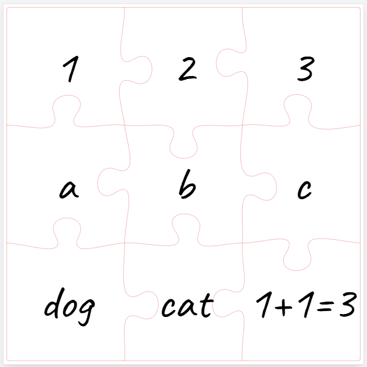

# Laser Jigsaw Puzzle Generator 🧩

A simple, browser-based tool to generate labeled jigsaw puzzles optimized for laser cutting.

## 🚀 Use the Tool
**Click here to run the generator:** ### 👉 [Open Jigsaw Generator](https://astbis.github.io/laser-jigsaw-generator/jigsaw_puzzle.html)

*(No download required! Runs directly in your browser.)*
---

  
  

---

## Why this was created
This tool was built to create **educational learning tools for schools**. 

While there are many puzzle generators out there, most are designed for printing images on paper. This tool is specifically designed for **Laser Cutters** (like Trotec, Epilog, or diode lasers). It generates an SVG file where:
* **Red Lines (#FF0000):** Defined as hairline vectors (0.01mm) for cutting the pieces.
* **Black Text (#000000):** Defined as filled shapes for raster engraving (burning) text onto the pieces.

This allows teachers and makers to easily create "match the pairs" games, math puzzles, or language learning tiles out of wood or acrylic.

## Features
* **Laser Optimized:** Set exact cut-line widths (e.g., 0.01mm) so your laser software (LightBurn, RDWorks) recognizes them as cuts immediately.
* **Educational Labels:** Add a list of words, numbers, or math problems that are automatically centered on each puzzle piece.
* **Typography:** Choose from various handwritten and clean fonts (Google Fonts) with full Danish character support (æ, ø, å).
* **Customizable:** Adjust grid size, puzzle size, jitter (randomness), and tab size.

## How to use
1.  Click the link above to open the tool.
2.  Configure your puzzle size and grid.
3.  Enter your text in the "Labels" box (comma separated).
4.  Click **Download SVG**.
5.  Import the SVG into your laser software.

## Credits & License
This project is licensed under the **Creative Commons Attribution-ShareAlike 4.0 International License (CC-BY-SA 4.0)**.

* **Original Code:** Based on the work by [Draradech](https://github.com/Draradech/jigsaw), originally licensed under CC-BY-SA.
* **Modifications:** Updated UI, added laser-specific stroke settings, and integrated Google Fonts.
* **Development:** Created with the assistance of AI.

You are free to share and adapt this material, as long as you give appropriate credit and distribute your contributions under the same license.
